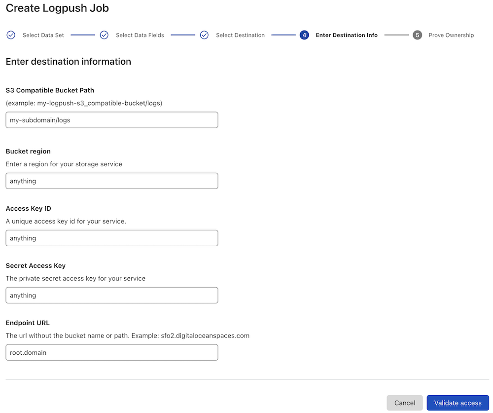

# Matched Data JS

## Logpush Setup

1. Dataset:
   - Firewall Events
2. Select Data Fields:
   - Required: General > Metadata
   - Any others are optional
3. Select Destination:
   - S3 Compatible
4. Enter Destination Info (see example below):
   - Given the final URL you want to use is `<subdomain>.<example.com>/logs`:
     - `<subdomain>` and `<example.com>` are arbitrary
     - `logs` is required according to the default configuration of the worker
   - _S3 Compatible Bucket Path_: `<subdomain>/logs`
   - _Endpoint URL_: `<example.com>`
   - All other fields can be arbitrary values

### Logpush Setup Example



## Configure and Deploy

1. Edit `wrangler.toml` to add `DOMAIN`, `SUBDOMAIN`, and `ACCOUNTID`.
2. Edit `src/index.ts` (line 36) to send the decoded data anywhere you would like.
3. Run `npx wrangler secret put MATCHED_PAYLOAD_PRIVATE_KEY`:
   - Enter the private key generated when deploying a matched payload.
   - Refer to the [documentation](https://developers.cloudflare.com/waf/managed-rules/payload-logging/) for more information on generating the private/public key pair.
4. Run `npm run deploy`.

# Matched Payload Format

The matched data payload is base64 encoded, and then binary encoded using the following format:

```
[version: 1 byte][encapped key: 32 bytes][payload size: 8 bytes][payload: N bytes]
```

## Local testing

1. Run `echo 'MATCHED_PAYLOAD_PRIVATE_KEY=uBS5eBttHrqkdY41kbZPdvYnNz8Vj0TvKIUpjB1y/GA=' > .dev.vars` (taken from https://github.com/cloudflare/matched-data-cli).
2. In terminal window 1, run: `npm run dev`.
3. In terminal window 2, run: `npm run req`.
4. Back in terminal window 1, you should see `'test matched data'`.

### See Also

https://github.com/cloudflare/matched-data-cli
